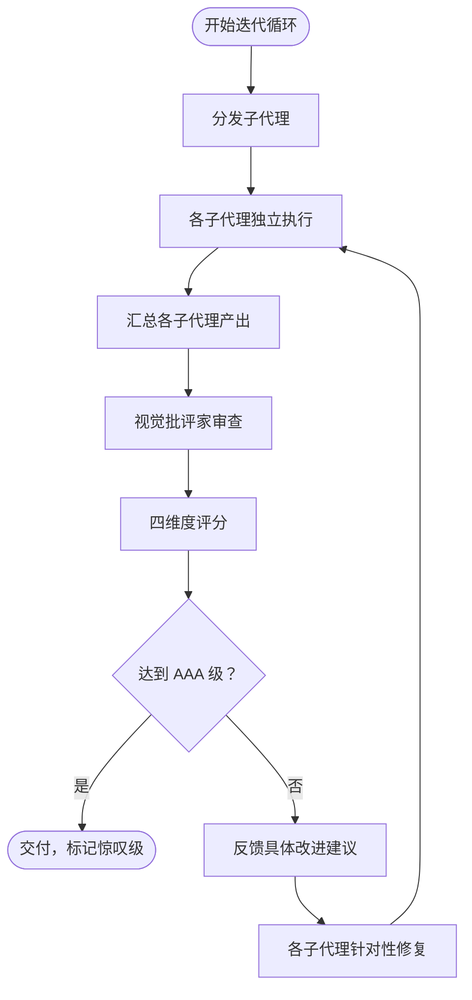

# AAA 级视觉质量保障协议 (AAA Visual Quality Assurance Protocol)

> 架构优化确保"内在健康"，AAA 协议确保"外在惊艳"。两者结合，交付物才能达到极致完美。

---

## 定位

本协议是 arch-optimize 技能的**视觉质量层补充**。

arch-optimize 技能的五阶段工作流（架构感知 → 风险诊断 → 质量度量 → 增量优化 → 回归防护）确保交付物的"内在健康"——架构有序、代码可维护、回归可控。然而，"内在健康"不等于"外在惊艳"。一份技术上无懈可击的报告，若排版混乱、表格错位、图表模糊，仍无法称为 AAA 级交付物。

AAA 协议补足这一缺口：通过**子代理分发**与**严厉批评家迭代循环**，确保每一个交付物在架构、代码、文档、视觉四个维度同时达到极致。两者结合，交付物才能达到极致完美。

**与其他参考文档的关系**：

| 文档 | 关注层 | 与本协议关系 |
|------|--------|-------------|
| `architecture-principles.md` | 架构内在健康 | 提供架构维度评判依据 |
| `coding-conventions.md` | 代码内在健康 | 提供代码维度评判依据 |
| `quality-metrics.md` | 量化基线 | 提供客观评分输入 |
| `regression-guard.md` | 回归防护 | 提供回归维度评判依据 |
| `collaboration-workflow.md` | 双智能体协作 | 本协议将其扩展为四子代理 |
| **`aaa-quality-protocol.md`** | **视觉与整体惊艳** | **本协议** |

---

## 核心原则

### 原则一：子代理分发

- 每个子代理**单独负责一个方面**（架构 / 代码 / 文档 / 视觉），职责不重叠
- 子代理**独立工作，互不干扰**，各自只看到完成任务所需的信息（信息隔离）
- 各子代理产出**汇总后统一审查**，避免局部最优掩盖整体缺陷

> 子代理分发是对 `collaboration-workflow.md` 双智能体模式（架构师 + 程序员）的扩展：在原有两个执行型子代理之上，新增视觉批评家与回归守卫两个审查型子代理，形成"执行—审查"闭环。

### 原则二：循环迭代

- 对每个项目进行**循环检查**，而非一次性通过
- 视觉批评家子代理从视觉角度审查全部交付物
- **不达 AAA 级继续迭代，没有例外**——不存在"差不多就交付"

### 原则三：严厉批评家

- 视觉批评家子代理是**非常严厉的批评家**
- 标准：**看起来不像 AAA 级就否决**
- 否决**必须附带具体改进建议**，不接受"再改改"这类空话
- **不接受**"差不多""还可以""基本满足"等模糊评价

### 原则四：质量惊叹

- 最终标准：**每个子代理都对质量感到惊叹**
- "惊叹"定义：**超出预期，无可挑剔**——不是"没有问题"，而是"令人惊艳"
- 达到惊叹前不停止迭代

---

## 子代理角色定义

本协议在双智能体协作基础上扩展为四个子代理角色。前两者负责"执行"，后两者负责"审查"。

| 子代理 | 职责范围 | 输入 | 输出 | 否决权 |
|--------|---------|------|------|--------|
| 架构师 | 架构设计、模块划分、风险诊断 | 需求文档 + 代码库 | 架构方案 + 改进需求 | 仅架构维度 |
| 程序员 | 代码实现、测试编写、增量修改 | 架构方案 + 编码规范 | 可运行代码 + 验证报告 | 仅代码维度 |
| 视觉批评家 | 视觉审查、美观度评估、整体一致性 | 所有交付物 | 审查报告 + 四维评分 | **全局否决权** |

**角色协作拓扑**：

```
        ┌─────────────┐
        │   架构师     │  战略层
        └──────┬──────┘
               │ 架构方案
               ▼
        ┌─────────────┐         ┌─────────────┐
        │   程序员     │ ◄─────► │  回归守卫    │  执行层 + 防护
        └──────┬──────┘         └─────────────┘
               │ 交付物
               ▼
        ┌─────────────┐
        │ 视觉批评家   │  审查层（全局否决权）
        └──────┬──────┘
               │ 通过 / 否决
               ▼
          交付 / 迭代
```

**关键设计**：视觉批评家拥有**全局否决权**，即使架构师与程序员认为已完成，只要视觉批评家判定未达 AAA 级，交付物不得发布。这是"外在惊艳"的最终防线。

---

## AAA 级评分标准

AAA 级评分采用**四维度百分制**，每个维度满分 25 分，总分 100 分。各维度评分项独立打分，取各项之和为维度得分。

### 代码维度（满分 25 分）

| 评分项 | 分值 | AAA 级标准（满分要求） | 扣分触发条件 |
|--------|------|----------------------|-------------|
| 无死代码 / 占位符 | 5 | 无 TODO/FIXME、无注释掉的代码、无占位返回值、无假实现 | 存在任一即扣 5 分 |
| 命名清晰准确 | 5 | 命名表意，无需注释即可理解意图，无 `tmp`/`data`/`foo` | 每处模糊命名扣 1 分 |
| 结构层次分明 | 5 | 函数 ≤50 行、嵌套 ≤3 层、单一职责、参数 ≤4 | 每项超标扣 1-2 分 |
| 错误处理完善 | 5 | 所有错误路径有处理，无吞异常，错误信息可定位 | 每处吞异常扣 2 分 |
| 性能可接受 | 5 | 无明显 O(n²) 热点、无冗余 IO、无阻塞主线程 | 每处性能缺陷扣 1-2 分 |

### 架构维度（满分 25 分）

| 评分项 | 分值 | AAA 级标准（满分要求） | 扣分触发条件 |
|--------|------|----------------------|-------------|
| 依赖方向一致 | 5 | 依赖单向流动，无循环依赖，领域不依赖基础设施 | 存在循环依赖即扣 5 分 |
| 模块边界清晰 | 5 | 模块职责单一，限界上下文明确，无越界访问 | 每处越界扣 1-2 分 |
| 领域模型忠实 | 5 | 代码忠实表达问题域，无贫血模型，命名与领域一致 | 贫血模型扣 3-5 分 |
| 技术债可控 | 5 | Pain×Spread ≤3，无 Critical debt，有意债务有偿还计划 | Critical debt 扣 5 分 |
| 可测试性 | 5 | 依赖可注入，纯函数占比高，测试无需外部状态 | 无法单测扣 3-5 分 |

### 文档维度（满分 25 分）

| 评分项 | 分值 | AAA 级标准（满分要求） | 扣分触发条件 |
|--------|------|----------------------|-------------|
| 内容详实 | 5 | 每段有实质信息，无注水，覆盖关键决策与取舍 | 空洞段落扣 2 分 |
| 无套话空话 | 5 | 无"显而易见""不言而喻"等填充，无 AI 味套话 | 每处套话扣 1 分 |
| 结构清晰 | 5 | 层级合理，导航顺畅，前后呼应无断裂 | 结构混乱扣 2-3 分 |
| 代码示例有效 | 5 | 示例可运行，与正文一致，标注语言与版本 | 不可运行示例扣 3 分 |
| 引用真实可查 | 5 | 引用的论文 / 链接 / 标准真实存在，可追溯 | 虚假引用扣 5 分 |

### 视觉维度（满分 25 分）

| 评分项 | 分值 | AAA 级标准（满分要求） | 扣分触发条件 |
|--------|------|----------------------|-------------|
| 排版美观 | 5 | 留白得当，层级视觉分明，无大段文字墙 | 文字墙扣 2 分 |
| 表格对齐 | 5 | 所有表格列对齐，表头清晰，无错位换行 | 错位扣 2 分 |
| 代码块标注 | 5 | 代码块标注语言，有注释关键行，长度适中 | 未标注语言扣 1 分 |
| 图表清晰 | 5 | Mermaid 图可渲染，节点 / 边含义明确，无交叉混乱 | 不可渲染扣 5 分 |
| 整体一致性 | 5 | 术语统一、风格统一、标点统一、中英文混排规范 | 风格不一扣 2 分 |

### 评级标准

| 总分 | 评级 | 处置 |
|------|------|------|
| 95-100 | AAA+ | 通过，标记为**惊叹级** |
| 90-94 | AAA | 通过 |
| 80-89 | AA | 需改进后重新审查 |
| 70-79 | A | 必须迭代 |
| <70 | B | 推翻重来 |

**通过门槛**：仅 AAA（90+）与 AAA+（95+）评级可交付。AA 及以下必须继续迭代，没有例外。

---

## 迭代循环流程



**流程说明**：

| 步骤 | 执行者 | 动作 | 产出 |
|------|--------|------|------|
| 分发子代理 | 协调器 | 按角色分发任务，传递必要上下文 | 任务清单 |
| 各自执行 | 四子代理 | 独立完成各自职责 | 架构方案 / 代码 / 审查报告 / 回归报告 |
| 汇总产出 | 协调器 | 收集所有子代理产出，去重对齐 | 统一交付物包 |
| 视觉批评家审查 | 视觉批评家 | 四维度逐项审查 | 审查报告 + 评分 |
| 评分 | 视觉批评家 | 汇总四维度得分，定级 | 总分 + 评级 |
| AAA 判定 | 视觉批评家 | 是否 ≥90 分且无 Blocker | 通过 / 否决 |
| 反馈改进 | 视觉批评家 | 附具体位置 + 建议 + 预期效果 | 否决报告 |
| 针对性修复 | 相关子代理 | 按建议修复，不引入新问题 | 修订交付物 |

**迭代终止条件**（满足任一即停止）：

1. 评级达到 AAA+（95+）——理想终止
2. 评级达到 AAA（90-94）且无 Blocker——可接受终止
3. 连续 3 次否决同一问题——升级人工审查，暂停自动迭代

---

## 批评家否决规则

视觉批评家的否决权是 AAA 协议的核心约束机制。否决不是否定，而是**驱动迭代的质量信号**。

### 自动否决条件

| 编号 | 否决条件 | 触发阈值 | 否决类型 |
|------|---------|---------|---------|
| V1 | 任何维度得分低于该维度满分的 80% | 单维度 <20 分 | 自动否决 |
| V2 | 存在 Blocker 级问题 | 死代码 / 循环依赖 / 虚假引用 / 不可渲染图表 | 自动否决 |
| V3 | 视觉批评家主观感受"不够惊艳" | 即使分数达标 | 主观否决 |

> V3 是 AAA 协议区别于普通质量门禁的关键：**分数达标但不够惊艳，依然否决**。这确保交付物不止于"合格"，而是追求"惊叹"。

### 否决报告规范

每次否决**必须附带**以下四要素，缺一不可：

| 要素 | 说明 | 示例 |
|------|------|------|
| 具体问题位置 | 文件 + 行号 / 章节 + 段落 / 图表编号 | `references/quality-metrics.md §4.2 表格` |
| 问题描述 | 客观陈述缺陷，不带情绪 | "表格第三列未对齐，表头与内容错位" |
| 改进建议 | 可执行的具体动作，非空话 | "将列宽统一，表头加粗，补齐分隔行" |
| 预期效果 | 修复后达到的状态 | "表格视觉对齐，评分从 3 分提升至 5 分" |

**反面示例（禁止）**：

- "排版不好看，再改改"——无位置、无建议
- "感觉差点意思"——无具体问题
- "整体还行但不够惊艳"——无改进方向

### 升级机制

| 触发条件 | 处置 |
|---------|------|
| 连续 3 次否决同一问题 | 升级为人工审查，暂停自动迭代 |
| 连续 5 次迭代仍未达 AAA | 全体子代理复盘，重新评估目标可行性 |
| 出现 V2 Blocker 但无法定位 | 引入 archcore:audit 外部审查 |

---

## 与 arch-optimize 五阶段的集成

AAA 协议不是独立流程，而是**嵌入 arch-optimize 五阶段工作流的审查层**。每个阶段产出后，触发对应的 AAA 集成点。

| 阶段 | AAA 集成点 | 审查内容 | 触发条件 |
|------|-----------|---------|---------|
| 阶段一 架构感知 | 目录树与依赖图可视化审查 | Mermaid 依赖图可渲染性、节点命名清晰度、循环依赖标注 | 扫描完成后 |
| 阶段二 风险诊断 | 诊断报告格式审查 | 四段式结构完整性、Symptom→Remedy 链路通顺、表格对齐 | 诊断完成后 |
| 阶段三 质量度量 | 质量仪表盘可读性审查 | 仪表盘排版、指标标注、状态标记一致 | 度量完成后 |
| 阶段四 增量优化 | 代码与文档一致性审查 | 代码符合编码规范、需求文档与实现一致、注释有效 | 实现完成后 |

**集成模式**：

```
阶段一 ──► AAA 审查 ──► 通过 ──► 阶段二 ──► AAA 审查 ──► 通过 ──► 阶段三
                                                                   │
                                                                   ▼
阶段五 ◄── AAA 审查 ◄── 通过 ◄── 阶段四 ◄── AAA 审查 ◄── 通过 ◄── 阶段三
   │
   ▼
最终 AAA 总审（四维度评分）──► 交付 / 迭代
```

每个阶段的 AAA 审查是**局部审查**（聚焦该阶段产出），最终在阶段五之后进行**全局总审**（四维度完整评分）。局部审查不通过则不得进入下一阶段；全局总审不通过则回到对应阶段迭代。

**与质量门禁的协同**：

| 门禁来源 | 阈值 | 与 AAA 关系 |
|---------|------|------------|
| `regression-guard.md` 零退化率 | =100% | AAA 代码维度 V2 Blocker 前置条件 |
| `regression-guard.md` 健康分 | ≥70 | AAA 架构维度参考输入 |
| `quality-metrics.md` 新代码 MI | ≥15 | AAA 代码维度参考输入 |
| **AAA 总评** | **≥90** | **最终交付门禁** |

AAA 总评是所有门禁之上的**最终交付门禁**：即使其余门禁全部通过，AAA 总评未达 90 分，交付物仍不得发布。

---

## 设计理念总结

| 原则 | 来源 | 在本协议的体现 |
|------|------|--------------|
| 诊断先于修复 | brooks-lint | 视觉批评家先审查再反馈建议 |
| 量化优于直觉 | quality-metrics | 四维度百分制评分 |
| AAA 级视觉质量 | 本协议 | 严厉批评家 + 质量惊叹标准 |
| 子代理分发协作 | 本协议 | 每子代理负责一方面，视觉批评家全局否决 |

**一句话总结**：架构优化让交付物"经得起审视"，AAA 协议让交付物"令人惊叹"。
